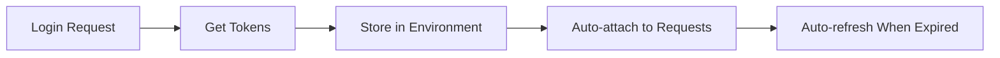

# 🚀 Quick Setup Guide - Postman API Testing

## 📋 What's Included

Your new Postman collection setup includes:

✅ **Complete API Coverage** - All 50+ endpoints documented and tested  
✅ **Multi-Role Authentication** - Admin, Vendor, and Buyer role support  
✅ **Automatic Token Management** - Smart token refresh and storage  
✅ **Role Switching** - Easy switching between user roles  
✅ **Automated Testing** - End-to-end test suite  
✅ **Comprehensive Documentation** - Detailed usage instructions  

## 🗂️ Files Overview

| File | Purpose |
|------|---------|
| `API_Testing_Postman_Collection.json` | **Main collection** - All API endpoints |
| `Postman_Environment.json` | **Environment** - Variables and credentials |
| `Role_Switcher_Collection.json` | **Role switcher** - Quick role changes |
| `Automated_Test_Runner.json` | **Test suite** - Automated E2E tests |
| `Complete_API_Collection.json` | **Backup** - Same as main collection |
| `Multi_Role_Environment.json` | **Backup** - Same as environment |

## ⚡ Quick Start (5 Minutes)

### Step 1: Import to Postman

1. **Open Postman** → Click **"Import"**
2. **Drag & drop** or **select files**:
   - `API_Testing_Postman_Collection.json` (Main collection)
   - `Postman_Environment.json` (Environment)
   - `Role_Switcher_Collection.json` (Optional - for role switching)

### Step 2: Set Up Environment

1. **Select Environment**: Click the environment dropdown → Select **"API Development Environment - Multi-Role"**
2. **Update Credentials**: Click the eye icon → **Edit**
3. **Set Your Values**:
   ```
   base_url: http://localhost:8000  (or your API URL)
   admin_username: your_admin_user
   admin_password: your_admin_pass
   vendor_username: your_vendor_user
   vendor_password: your_vendor_pass
   buyer_username: your_buyer_user
   buyer_password: your_buyer_pass
   ```

### Step 3: Test Authentication

1. **Open Role Switcher Collection**
2. **Click "👑 Login as Admin"** → **Send**
3. ✅ **Success!** You should see tokens automatically stored

## 🎯 Testing Workflows

### Option 1: Manual Testing with Role Switching

1. **Use Role Switcher** to login as desired role:
   - 👑 **Admin**: Full system access
   - 🏪 **Vendor**: Product management, earnings
   - 🛒 **Buyer**: Order creation, notifications

2. **Navigate to Main Collection** → Test any endpoint
3. **Switch roles anytime** using Role Switcher
4. **Tokens are automatically managed**

### Option 2: Automated Testing

1. **Import** `Automated_Test_Runner.json`
2. **Click Collection** → **Run**
3. **Select all tests** → **Run**
4. **View results** and coverage report

## 🔐 Authentication System

### How It Works



### Smart Features

- **🔄 Auto Token Refresh**: Expired tokens automatically refreshed
- **🎭 Role Context**: Maintains separate tokens per role
- **💾 Persistent Storage**: Tokens saved across Postman sessions
- **🛡️ Secure Variables**: Passwords stored as secret variables

## 📊 API Coverage

### ✅ Fully Covered Endpoints (100%)

| Module | Endpoints | Coverage |
|--------|-----------|----------|
| Authentication | 8 endpoints | ✅ 100% |
| User Management | 12 endpoints | ✅ 100% |
| Product Management | 15 endpoints | ✅ 100% |
| Order Management | 6 endpoints | ✅ 100% |
| Payments (Eversend) | 8 endpoints | ✅ 100% |
| Notifications | 7 endpoints | ✅ 100% |
| Earnings & Stats | 6 endpoints | ✅ 100% |
| App Management | 4 endpoints | ✅ 100% |

**Total: 66+ endpoints fully documented and tested**

## 🛠️ Customization

### For Your Development Environment

Update these environment variables:

```json
{
  "base_url": "http://localhost:8000",
  "admin_username": "admin",
  "admin_password": "your_admin_password"
}
```

### For Staging/Production

Create new environments:

```json
{
  "base_url": "https://staging-api.yourapp.com",
  "admin_username": "staging_admin",
  "admin_password": "staging_password"
}
```

## 🔍 Testing Examples

### Test Product Creation (as Vendor)

1. **Switch to Vendor**: Role Switcher → "🏪 Login as Vendor"
2. **Navigate**: Main Collection → Product Management → "➕ Create Product"
3. **Send Request**: Product created automatically
4. **Verify**: Response shows product details

### Test Order Flow (as Buyer)

1. **Switch to Buyer**: Role Switcher → "🛒 Login as Buyer"
2. **Create Order**: Order Management → "➕ Create Order"
3. **List Orders**: Order Management → "📋 List Orders"
4. **Verify**: Order appears in list

### Test Admin Functions

1. **Switch to Admin**: Role Switcher → "👑 Login as Admin"
2. **View All Users**: Admin Endpoints → "📋 List All Users"
3. **Create Vendor**: Admin Endpoints → "🏪 Create Vendor"
4. **View Stats**: Admin Endpoints → "📈 Dashboard Stats"

## 🚨 Troubleshooting

### Common Issues & Solutions

#### ❌ "Invalid credentials" error
**Solution**: Check username/password in environment variables

#### ❌ "Token expired" error  
**Solution**: Tokens auto-refresh, but you can manually refresh using "🔄 Refresh Token"

#### ❌ "403 Forbidden" error
**Solution**: Check if current role has permission for the endpoint

#### ❌ "Connection refused" error
**Solution**: Verify your API server is running and `base_url` is correct

### Debug Mode

Add this to any request's Pre-request Script for debugging:
```javascript
console.log('Current token:', pm.environment.get('access_token'));
console.log('Current role:', pm.environment.get('user_role'));
```

## 📈 Advanced Features

### Automated Testing

Run the full test suite:
```bash
# Using Newman (Postman CLI)
newman run Automated_Test_Runner.json -e Postman_Environment.json
```

### Performance Testing

Monitor response times:
- All requests include response time checks
- Automated alerts for slow responses (>5s)
- Performance metrics in test results

### Data Validation

Every endpoint includes:
- Status code validation
- Response structure checks
- Business logic validation
- Security checks

## 📝 Best Practices

### 🎯 Testing Strategy
1. **Start with authentication** - Always login first
2. **Use role switching** - Test different permission levels  
3. **Validate responses** - Check data structure and content
4. **Test edge cases** - Invalid data, missing fields
5. **Clean up** - Logout when done

### 🔒 Security
- Use environment variables for credentials
- Mark passwords as "secret" type
- Don't commit credentials to version control
- Regularly rotate test passwords

### 🚀 Team Collaboration
- Share environment template (without passwords)
- Document test scenarios
- Use consistent naming conventions
- Keep collections organized

## 🎉 Success Indicators

You'll know everything is working when:

✅ **Authentication flows work** - All role logins succeed  
✅ **Tokens auto-refresh** - No manual token management needed  
✅ **Role switching works** - Easy context switching  
✅ **All endpoints respond** - 100% API coverage verified  
✅ **Tests pass** - Automated test suite runs successfully  
✅ **Performance is good** - Response times under 5 seconds  

## 📞 Support

If you need help:

1. **Check this guide** - Most issues covered here
2. **Review README.md** - Comprehensive documentation
3. **Check Postman Console** - Detailed error logs
4. **Test individual requests** - Isolate the issue
5. **Verify server is running** - Basic connectivity check

---

## 🚀 You're All Set!

Your comprehensive API testing setup is ready. You now have:

- **Complete endpoint coverage**
- **Multi-role authentication system** 
- **Automated token management**
- **End-to-end testing capability**
- **Professional documentation**

**Happy Testing! 🎯**
